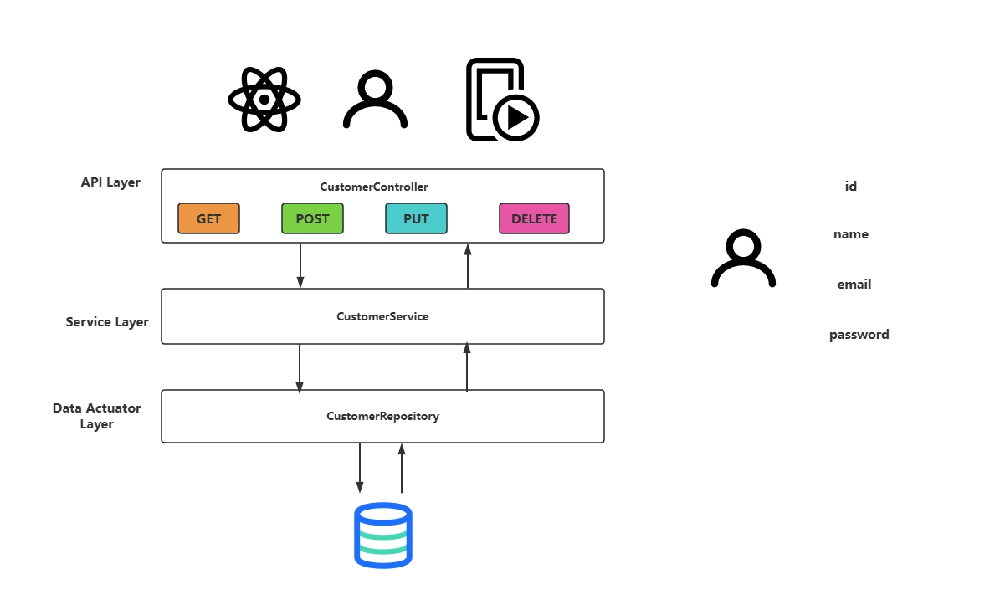

# Spring Boot Practice
## Java, Maven, Slf4j, Lombok, Actuator, Feign, Test

- this project is a simple people's information system
- You can interact with the character information in the database in a simple way, including querying by id, creating, updating, and deleting

## Framework

